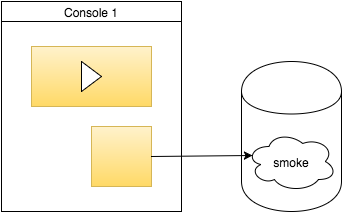

Project Plan
-----------------------

### 1. Team

* 999999 Peter Venkman
* 999998 Ray Stantz
* 601098 Qianqian Qin

### 2. Goal

In this project, the group aims to develop a online game store for JavaScript games. The users of this web application include players and developers. Games can be added and sold by developers, and then can be purchased and played online by players. The application will be fully functional and fully tested.

### 3. Application Functionalities

#### 3.1 Features
##### Basic Features
* Authentication (as a player or a developer)
	- Login, Logout, Register, Email validation

* Basic player functionalities
	- Buy games
	- Play games only if purchased
	- Searching games
	- Seeing a list of purchased games
	- Seeing top scores for each game

* Basic develop functionalities
	- Basic game inventory
	-  Managing their own game(s) (add/remove/modify) and set price(s) for the game(s) in their own inventory
	-  Seeing sale statistics

* Game/service interaction
	- Messages are exchanged between game and the game service with window.postMessage.
	- From the game to the service: Informing a new score (then the score is recorded), Saving the sent game state, Requesting a game state previously saved, Settings telling game specific configuration.
	- From the service to the game: Loading a saved game state, Informing error information.

##### Advanced Features

<!---  --->

#### 3.2 Development Technologies
* HTML, CSS, Javascript
* Python 3.6
* Django framework
* Javascript library: jQuery 
* CSS library: Bootstrap
* PostgreSQL

#### 3.3 Models

#### 3.4 Views

#### 3.5 Testing

### 4. Steps and Schedule

#### 4.1 Steps

* Planning (DL: 21.12.2017 midnight)
* Implementing the function Authentication 
* Constructing models
* Hooking up views
* Making templates
* Game/service interaction
* Testing the roughly finished project locally
* Deploying the finished project to Heroku
* Final submission (DL: 19.2.2018 midnight)
* Project demonstration

Some steps are possible to be interactive. During the implementation phase (Step 2-6), appropriate testing will be done after finishing each step.

#### 4.2 Schedule
* 16 Dec-21 Dec: Researching the topic, Collecting materials and Making the project plan.
* 22 Dec-9 Jan: Realizing the function Authentication. And design of models is accomplished or towards the end.
* 10 Jan-6 Feb: Developing views, templates and the function Game/service interaction. Trying to do the initial Heroku deployment.
* 7 Feb-18 Feb: Deploying the project first locally, and then to Heroku. Writing the final documentation.

The schedule is roughly designed. The practical and detailed timeline probably changes and will be recorded during the process of the project.

### 5. Practical Arrangement

#### 5.1 Meeting 

* Frequency: Once or twice a week. It will vary based on project progress.
* Location: Otaniemi Campus or online (Skype or Google Hangouts), depending on the situation. The group will try to hold face-to-face meetings regularly.
* Purpose: 
	- Tracking the progress of the project.
	- Sharing information between the team.
	- Proposing suggestions to the project.
	- Making some adjustments if necessary.
	- Distributing tasks of the next week.

#### 5.2 Project Management Tools

* Gitlab: Used for source code management, version control and issue tracking, etc.
* Slack: Team discussion.
* Trello: Task management, including task assignment and task status tracking, etc.
* Google Drive: Sharing relevant materials.

#### 5.3 Communication Tools

* Wechat: Instant communication if necessary, e.g., sending notifications to members about important topics posted to the project management tools.
	
### 6. Risk Analysis

